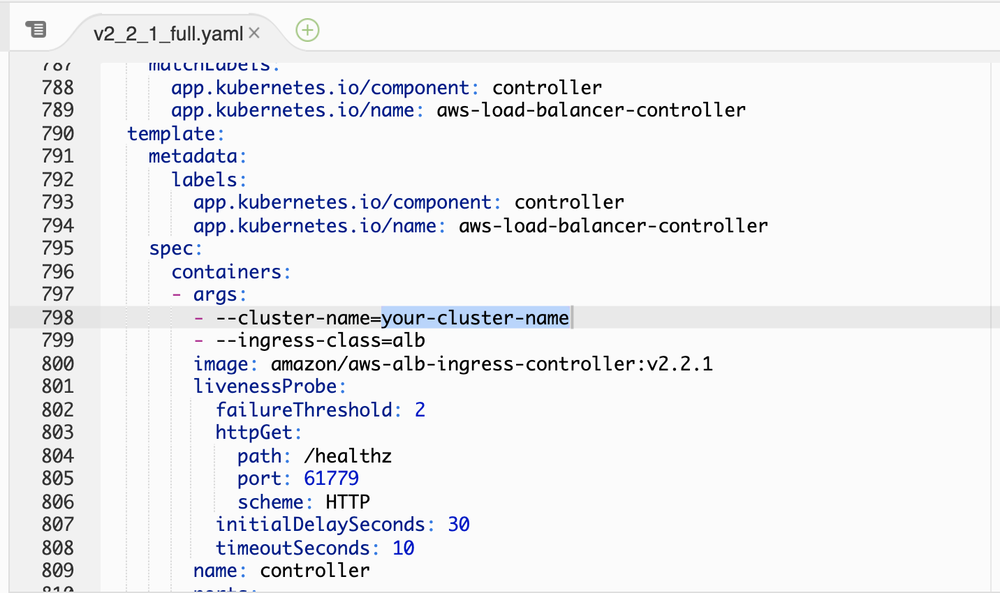

# 步骤4  部署、配置AWS Loadbalacner Controller &2048游戏

4.1 准备权限

> 4.1.1 创建IAM OIDC provider

```bash
export CLUSTER_NAME=eksworkshop
export AWS_DEFAULT_REGION=us-west-2
eksctl utils associate-iam-oidc-provider \
    --cluster=$CLUSTER_NAME \
    --approve
```

> 4.1.2 下载yaml文件

```bash
curl -o iam-policy.json https://raw.githubusercontent.com/kubernetes-sigs/aws-load-balancer-controller/v2.3.1/docs/install/iam_policy.json

```

> 4.1.3 创建对应的policy

```bash
aws iam create-policy \
    --policy-name AWSLoadBalancerControllerIAMPolicy \
    --policy-document file://iam-policy.json
    
#参考输出
{
    "Policy": {
        "PolicyName": "AWSLoadBalancerControllerIAMPolicy", 
        "PermissionsBoundaryUsageCount": 0, 
        "CreateDate": "2021-08-28T15:03:32Z", 
        "AttachmentCount": 0, 
        "IsAttachable": true, 
        "PolicyId": "ANPAYVRRQ4TUEMTZVTZYW", 
        "DefaultVersionId": "v1", 
        "Path": "/", 
        "Arn": "arn:aws:iam::59********44:policy/AWSLoadBalancerControllerIAMPolicy", 
        "UpdateDate": "2021-08-28T15:03:32Z"
    }
}
```

> 4.1.4 为AWS Load Balancer controller,创建一个IAM role 和 ServiceAccount 

```bash
eksctl create iamserviceaccount \
       --cluster=$CLUSTER_NAME \
       --namespace=kube-system \
       --name=aws-load-balancer-controller \
       --attach-policy-arn=arn:aws:iam::59********44:policy/AWSLoadBalancerControllerIAMPolicy \
       --override-existing-serviceaccounts \
       --approve
```


4.2 配置、安装aws-load-balancer-controller

> 4.2.1 安装cert-manager

```bash
kubectl apply --validate=false -f https://github.com/jetstack/cert-manager/releases/download/v1.0.2/cert-manager.yaml
```

> 4.2.2 下载aws-loadbalancer-controller

```bash
curl -OL https://raw.githubusercontent.com/kubernetes-sigs/aws-load-balancer-controller/v2.2.1/docs/install/v2_2_1_full.yaml

```

> 4.2.3 在cloud9中编辑v2_2_1_full.yaml,将--cluster-name=your-cluster-name 修改为--cluster-name=eksworshop



> 4.2.3 请删除v2_2_1_full.yaml中的Servcie Account,因为我们已经通过eksctl创建了该Servcie Account

```bash
---
apiVersion: v1
kind: ServiceAccount
metadata:
  labels:
    app.kubernetes.io/component: controller
    app.kubernetes.io/name: aws-load-balancer-controller
  name: aws-load-balancer-controller
  namespace: kube-system
```

> 4.2.4 安装 aws-load-balancer-controller
>
> 在新的版本里面 [kubernetes.io/ingress.class](http://kubernetes.io/ingress.class) annotation 会被遗弃掉, 1.18开始增加了ingressClassName ,然后在spec里面使用ingressClassName即可

```bash
kubectl apply -f v2_2_1_full.yaml

#创建IngressClass
cat << EOF >> ingress_alb.yaml
---
apiVersion: networking.k8s.io/v1
kind: IngressClass
metadata:
  name: alb
spec:
  controller: ingress.k8s.aws/alb
EOF
```


4.3 使用 aws-load-balancer-controller

> 4.3.1 部署2048游戏

```bash
#生成2048配置文件


curl -s https://raw.githubusercontent.com/kubernetes-sigs/aws-load-balancer-controller/main/docs/examples/2048/2048_full.yaml \
    | sed 's=alb.ingress.kubernetes.io/target-type: ip=alb.ingress.kubernetes.io/target-type: instance=g' > 2048_full.yaml
    
kubectl apply -f 2048_full.yaml

#查看ingress信息
kubectl get ingress/ingress-2048 -n game-2048

export GAME_2048=$(kubectl get ingress/ingress-2048 -n game-2048 -o jsonpath='{.status.loadBalancer.ingress[0].hostname}')
echo http://${GAME_2048}


```


> 4.3.2 在浏览器中访问2048游戏


> 4.3.3 清除2048 游戏

```bash
kubectl delete -f  2048_full_latest.yaml
```


参考文档 

https://kubernetes-sigs.github.io/aws-load-balancer-controller/v2.2/deploy/installation/

https://www.eksworkshop.com/beginner/130_exposing-service/ingress_controller_alb/
